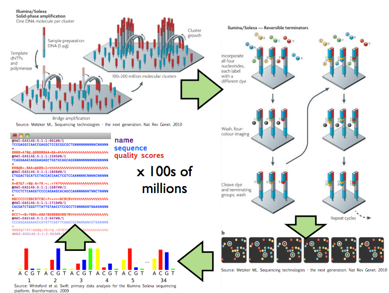
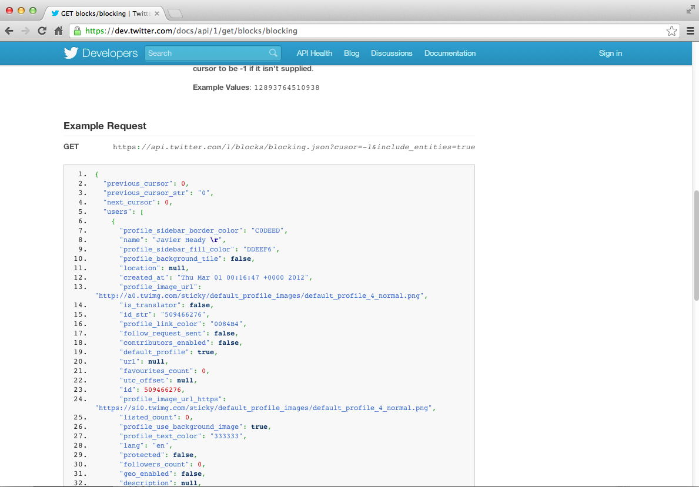
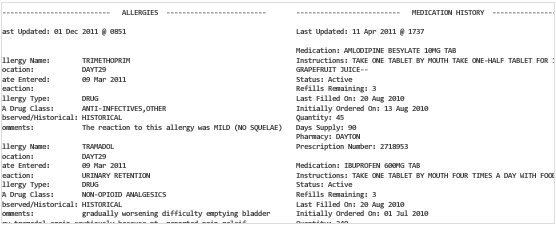

```{r setup, cache = F, echo = F, message = F, warning = F, tidy = F}
# make this an external chunk that can be included in any file
options(width = 70)
opts_chunk$set(message = F, error = F, warning = F, echo = F, comment = NA, fig.align = 'center', dpi = 100, tidy = F, cache = T, cache.path = '.cache/', fig.path = 'fig/')

options(xtable.type = 'html')
knit_hooks$set(inline = function(x) {
  if(is.numeric(x)) {
    round(x, getOption('digits'))
  } else {
    paste(as.character(x), collapse = ', ')
  }
})
knit_hooks$set(plot = knitr:::hook_plot_html)
```


## Definition of data

<q>Data are values of qualitative or quantitative variables, belonging to a set of items.</q>

[http://en.wikipedia.org/wiki/Data](http://en.wikipedia.org/wiki/Data)


---

## Definition of data
<q>Data are values of qualitative or quantitative variables, belonging to a <redtext>set of items</redtext>.</q>

[http://en.wikipedia.org/wiki/Data](http://en.wikipedia.org/wiki/Data)

__Set of items__: Sometimes called the population; the set of objects you are interested in


---

## Definition of data
<q>Data are values of qualitative or quantitative <redtext>variables</redtext>, belonging to a set of items.</q>

[http://en.wikipedia.org/wiki/Data](http://en.wikipedia.org/wiki/Data)

__Variables__: A measurement or characteristic of an item.


---

## Definition of data
<q>Data are values of <redtext>qualitative</redtext> or <redtext>quantitative</redtext> variables, belonging to a set of items.</q>

[http://en.wikipedia.org/wiki/Data](http://en.wikipedia.org/wiki/Data)


__Qualitative__: Country of origin, sex, treatment

__Quantitative__: Height, weight, blood pressure

---

## Raw versus processed data

__Raw data__
* The original source of the data
* Often hard to use for data analyses
* Data analysis _includes_ processing
* Raw data may only need to be processed once

[http://en.wikipedia.org/wiki/Raw_data](http://en.wikipedia.org/wiki/Raw_data)

__Processed data__
* Data that is ready for analysis
* Processing can include merging, subsetting, transforming, etc.
* There may be standards for processing
* All steps should be recorded 

[http://en.wikipedia.org/wiki/Computer_data_processing](http://en.wikipedia.org/wiki/Computer_data_processing)

---

## An example of a processing pipeline


[http://www.illumina.com.cn/support/sequencing/sequencing_instruments/hiseq_1000.asp](http://www.illumina.com.cn/support/sequencing/sequencing_instruments/hiseq_1000.asp)

---

## An example of a processing pipeline



[http://www.cbcb.umd.edu/~hcorrada/CMSC858B/lectures/lect22_seqIntro/seqIntro.pdf](http://www.cbcb.umd.edu/~hcorrada/CMSC858B/lectures/lect22_seqIntro/seqIntro.pdf)

---


## What do raw data look like? 


[http://brianknaus.com/software/srtoolbox/s_4_1_sequence80.txt](http://brianknaus.com/software/srtoolbox/s_4_1_sequence80.txt)

---

## What do raw data look like? 



[https://dev.twitter.com/docs/api/1/get/blocks/blocking](https://dev.twitter.com/docs/api/1/get/blocks/blocking)

---

## What do raw data look like? 




[http://blue-button.github.com/challenge/](http://blue-button.github.com/challenge/)

---

## What do processed data look like?


1. Each variable forms a column
2. Each observation forms a row
3. Each table/file stores data about one kind of observation (e.g. people/hospitals).


[http://vita.had.co.nz/papers/tidy-data.pdf](http://vita.had.co.nz/papers/tidy-data.pdf)

[Leek, Taub, and Pineda 2011 PLoS One](http://www.plosone.org/article/info%3Adoi%2F10.1371%2Fjournal.pone.0026895)

