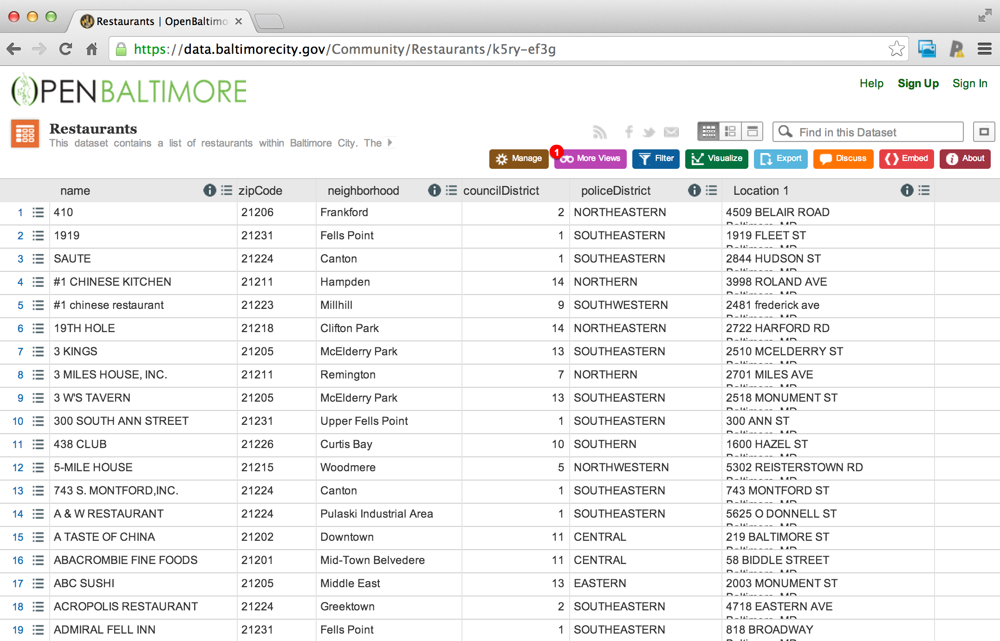

## Why create new variables?

* Often the raw data won't have a value you are looking for
* You will need to transform the data to get the values you would like
* Usually you will add those values to the data frames you are working with
* Common variables to create
  * Missingness indicators
  * Factors from numbers
  * "Cutting up" quantitative variables


---

## Example data set 




[https://data.baltimorecity.gov/Community/Restaurants/k5ry-ef3g](https://data.baltimorecity.gov/Community/Restaurants/k5ry-ef3g)

---

## Getting the data from the web


```r
if(!file.exists("./data")){dir.create("./data")}
fileUrl <- "https://data.baltimorecity.gov/api/views/k5ry-ef3g/rows.csv?accessType=DOWNLOAD"
download.file(fileUrl,destfile="./data/restaurants.csv",method="curl")
restData <- read.csv("./data/restaurants.csv")
```


---

## Creating sequences

_Sometimes you need an index for your data set_


```r
s1 <- seq(1,10,by=2)
s2 <- seq(1,10,length=3)
x <- c(1,3,8,25,100); seq(along = x)
```

```
[1] 1 2 3 4 5
```


---

## Subsetting variables


```r
restData$nearMe = restData$neighborhood %in% c("Roland Park", "Homeland")
table(restData$nearMe)
```

```

FALSE  TRUE 
 1314    13 
```


---

## Creating binary variables


```r
restData$zipWrong = ifelse(restData$zipCode < 0, TRUE, FALSE)
table(restData$zipWrong,restData$zipCode < 0)
```

```
       
        FALSE TRUE
  FALSE  1326    0
  TRUE      0    1
```


---

## Creating categorical variables


```r
restData$zipGroups = cut(restData$zipCode,breaks=quantile(restData$zipCode))
table(restData$zipGroups)
```

```

(-2.123e+04,2.12e+04]  (2.12e+04,2.122e+04] (2.122e+04,2.123e+04] (2.123e+04,2.129e+04] 
                  337                   375                   282                   332 
```

```r
table(restData$zipGroups,restData$zipCode)
```

```
                       
                        -21226 21201 21202 21205 21206 21207 21208 21209 21210 21211 21212 21213
  (-2.123e+04,2.12e+04]      0   136   201     0     0     0     0     0     0     0     0     0
  (2.12e+04,2.122e+04]       0     0     0    27    30     4     1     8    23    41    28    31
  (2.122e+04,2.123e+04]      0     0     0     0     0     0     0     0     0     0     0     0
  (2.123e+04,2.129e+04]      0     0     0     0     0     0     0     0     0     0     0     0
                       
                        21214 21215 21216 21217 21218 21220 21222 21223 21224 21225 21226 21227
  (-2.123e+04,2.12e+04]     0     0     0     0     0     0     0     0     0     0     0     0
  (2.12e+04,2.122e+04]     17    54    10    32    69     0     0     0     0     0     0     0
  (2.122e+04,2.123e+04]     0     0     0     0     0     1     7    56   199    19     0     0
  (2.123e+04,2.129e+04]     0     0     0     0     0     0     0     0     0     0    18     4
                       
                        21229 21230 21231 21234 21237 21239 21251 21287
  (-2.123e+04,2.12e+04]     0     0     0     0     0     0     0     0
  (2.12e+04,2.122e+04]      0     0     0     0     0     0     0     0
  (2.122e+04,2.123e+04]     0     0     0     0     0     0     0     0
  (2.123e+04,2.129e+04]    13   156   127     7     1     3     2     1
```


---

## Easier cutting


```r
library(Hmisc)
restData$zipGroups = cut2(restData$zipCode,g=4)
table(restData$zipGroups)
```

```

[-21226,21205) [ 21205,21220) [ 21220,21227) [ 21227,21287] 
           338            375            300            314 
```


---

## Creating factor variables


```r
restData$zcf <- factor(restData$zipCode)
restData$zcf[1:10]
```

```
 [1] 21206 21231 21224 21211 21223 21218 21205 21211 21205 21231
32 Levels: -21226 21201 21202 21205 21206 21207 21208 21209 21210 21211 21212 21213 21214 ... 21287
```

```r
class(restData$zcf)
```

```
[1] "factor"
```


---

## Levels of factor variables


```r
yesno <- sample(c("yes","no"),size=10,replace=TRUE)
yesnofac = factor(yesno,levels=c("yes","no"))
relevel(yesnofac,ref="yes")
```

```
 [1] yes yes yes yes no  yes yes yes no  no 
Levels: yes no
```

```r
as.numeric(yesnofac)
```

```
 [1] 1 1 1 1 2 1 1 1 2 2
```


---

## Cutting produces factor variables


```r
library(Hmisc)
restData$zipGroups = cut2(restData$zipCode,g=4)
table(restData$zipGroups)
```

```

[-21226,21205) [ 21205,21220) [ 21220,21227) [ 21227,21287] 
           338            375            300            314 
```

