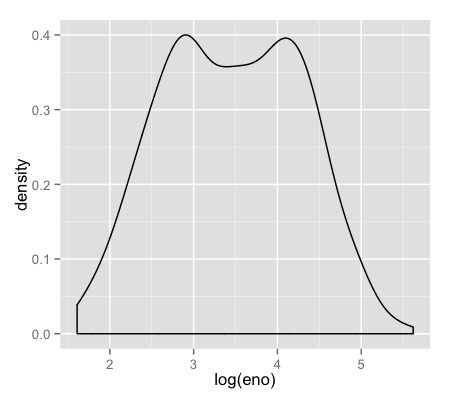

## What is ggplot2?

- An implementation of the __Grammar of Graphics__ by Leland Wilkinson
- Grammar of graphics represents and abstraction of graphics ideas/objects
- Think “verb”, “noun”, “adjective” for graphics
- Allows for a “theory” of graphics on which to build new graphics and graphics objects

---

## Basic Components of a ggplot2 Plot
A _data frame_
_aesthetic mappings_: how data are mapped to color, size 
_geoms_: geometric objects like points, lines, shapes. 
_facets_: for conditional plots. 
_stats_: statistical transformations like binning, quantiles, smoothing. 
_scales_: what scale an aesthetic map uses (example: male = red, female = blue). 
_coordinate system_ 

---

## Building Plots with ggplot2
- When building plots in ggplot2 (rather than using qplot) the “artist’s palette” model may be the closest analogy
- Plots are built up in layers
  - Plot the data
  - Overlay a summary
  - Metadata and annotation

---

## Example: BMI, PM$_{2.5}$, Asthma
- Mouse Allergen and Asthma Cohort Study
- Baltimore children (age 5-17)
- Persistent asthma, exacerbation in past year
- Does BMI (normal vs. overweight) modify the relationship between PM$_{2.5}$ and asthma symptoms?

---

## Basic Plot


```r
qplot(logpm25, NocturnalSympt, data = maacs, facets = . ~ bmicat, 
      geom = c("point", "smooth"), method = "lm")
```

<div class="rimage center"></div>


---

## Building Up in Layers


```r
head(maacs)
```

```
  logpm25        bmicat NocturnalSympt logno2_new
1  1.5362 normal weight              1      1.299
2  1.5905 normal weight              0      1.295
3  1.5218 normal weight              0      1.304
4  1.4323 normal weight              0         NA
5  1.2762    overweight              8      1.108
6  0.7139    overweight              0      0.837
```

```r
g <- ggplot(maacs, aes(logpm25, NocturnalSympt))
summary(g)
```

```
data: logpm25, bmicat, NocturnalSympt, logno2_new [554x4]
mapping:  x = logpm25, y = NocturnalSympt
faceting: facet_null() 
```


---

## No Plot Yet!


```r
g <- ggplot(maacs, aes(logpm25, NocturnalSympt))
print(g)
```


---

## First Plot with Point Layer


```r
g <- ggplot(maacs, aes(logpm25, NocturnalSympt))
g + geom_point()
```

<div class="rimage center"></div>


---

## Adding More Layers: Smooth


```r
g + geom_point() + geom_smooth()
g + geom_point() + geom_smooth(method = "lm")
```

<div class="rimage center">
</div>


---

## Adding More Layers: Facets


```r
g + geom_point() + facet_grid(. ~ bmicat) + geom_smooth(method = "lm")
```

<div class="rimage center"></div>


---

## Annotation
- Labels: `xlab()`, `ylab()`, `labs()`, `ggtitle()`
- Each of the “geom” functions has options to modify 
- For things that only make sense globally, use `theme()` 
  - Example: `theme(legend.position = "none")` 
- Two standard appearance themes are included
  - `theme_gray()`: The default theme (gray background)
  - `theme_bw()`: More stark/plain 

---

## Modifying Aesthetics


```r
g + geom_point(color = "steelblue", size = 4, alpha = 1/2)
g + geom_point(aes(color = bmicat), size = 4, alpha = 1/2)
```

<div class="rimage center">
</div>


---

## Modifying Labels


```r
g + geom_point(aes(color = bmicat)) + labs(title = "MAACS Cohort") + labs(x = expression("log " * PM[2.5]), y = "Nocturnal Symptoms")
```

<div class="rimage center"></div>


---

## Customizing the Smooth


```r
g + geom_point(aes(color = bmicat), size = 2, alpha = 1/2) + geom_smooth(size = 4, linetype = 3, method = "lm", se = FALSE)
```

<div class="rimage center"></div>


---

## Changing the Theme


```r
g + geom_point(aes(color = bmicat)) + theme_bw(base_family = "Times")
```

<div class="rimage center"></div>


---

## A Notes about Axis Limits


```r
testdat <- data.frame(x = 1:100, y = rnorm(100))
testdat[50,2] <- 100  ## Outlier!
plot(testdat$x, testdat$y, type = "l", ylim = c(-3,3))

g <- ggplot(testdat, aes(x = x, y = y))
g + geom_line()
```

<div class="rimage center">
</div>


---

## Axis Limits


```r
g + geom_line() + ylim(-3, 3)
g + geom_line() + coord_cartesian(ylim = c(-3, 3))
```

<div class="rimage center">
</div>


---

## More Complex Example
- How does the relationship between PM$_{2.5}$ and nocturnal symptoms vary by BMI and NO$_2$?
- Unlike our previous BMI variable, NO$_2$ is continuous
- We need to make NO$_2$ categorical so we can condition on it in the plotting
- Use the `cut()` function for this

---

## Making NO$_2$ Deciles


```r
## Calculate the deciles of the data
cutpoints <- quantile(maacs$logno2_new, seq(0, 1, length = 11), na.rm = TRUE)

## Cut the data at the deciles and create a new factor variable
maacs$no2dec <- cut(maacs$logno2_new, cutpoints)

## See the levels of the newly created factor variable
levels(maacs$no2dec)
```

```
 [1] "(0.378,0.969]" "(0.969,1.1]"   "(1.1,1.17]"    "(1.17,1.26]"  
 [5] "(1.26,1.32]"   "(1.32,1.38]"   "(1.38,1.44]"   "(1.44,1.54]"  
 [9] "(1.54,1.69]"   "(1.69,2.55]"  
```


---

## Final Plot


