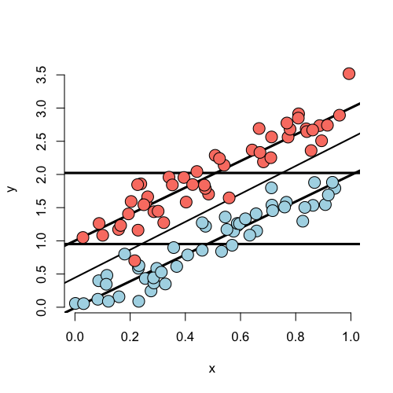
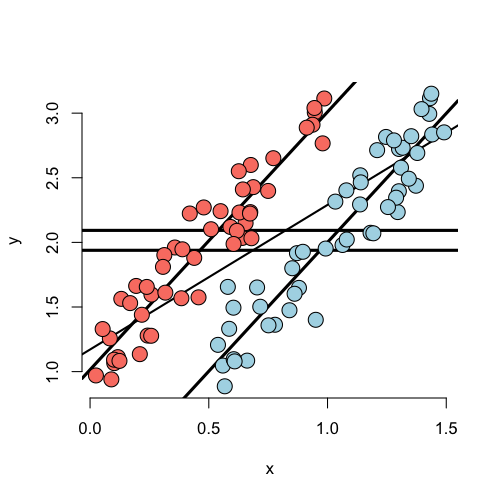

## Consider the following simulated data
Code for the first plot, rest omitted
(See the git repo for the rest of the code.)
```
n <- 100; t <- rep(c(0, 1), c(n/2, n/2)); x <- c(runif(n/2), runif(n/2)); 
beta0 <- 0; beta1 <- 2; tau <- 1; sigma <- .2
y <- beta0 + x * beta1 + t * tau + rnorm(n, sd = sigma)
plot(x, y, type = "n", frame = FALSE)
abline(lm(y ~ x), lwd = 2)
abline(h = mean(y[1 : (n/2)]), lwd = 3)
abline(h = mean(y[(n/2 + 1) : n]), lwd = 3)
fit <- lm(y ~ x + t)
abline(coef(fit)[1], coef(fit)[2], lwd = 3)
abline(coef(fit)[1] + coef(fit)[3], coef(fit)[2], lwd = 3)
points(x[1 : (n/2)], y[1 : (n/2)], pch = 21, col = "black", bg = "lightblue", cex = 2)
points(x[(n/2 + 1) : n], y[(n/2 + 1) : n], pch = 21, col = "black", bg = "salmon", cex = 2)
```


---
## Unadjusted and adjusted effects about the same
<div class="rimage center"></div>


---
## Marginal effect, no adjusted
<div class="rimage center"></div>


---
## Marginal and adjusted reversed
<div class="rimage center"></div>


---
## No marginal but adjusted effect
<div class="rimage center"></div>

