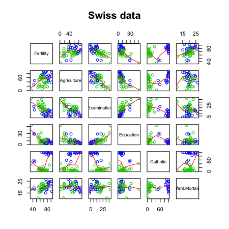
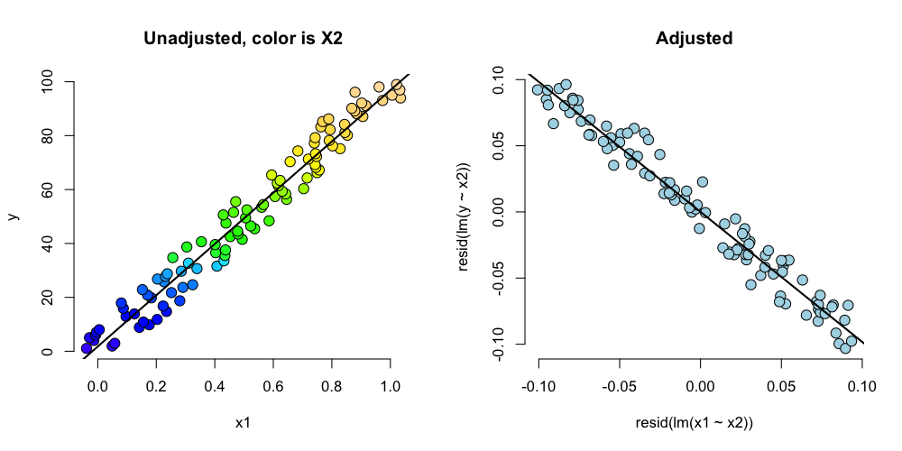
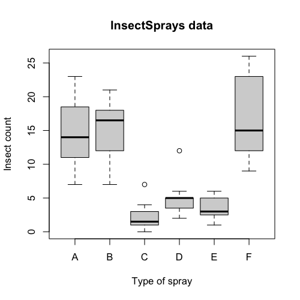

## Swiss fertility data

```r
library(datasets); data(swiss); require(stats); require(graphics)
pairs(swiss, panel = panel.smooth, main = "Swiss data", col = 3 + (swiss$Catholic > 50))
```

<div class="rimage center"></div>


---
## `?swiss`
### Description
Standardized fertility measure and socio-economic indicators for each of 47 French-speaking provinces of Switzerland at about 1888.

A data frame with 47 observations on 6 variables, each of which is in percent, i.e., in [0, 100].

* [,1]   Fertility	Ig, ‘ common standardized fertility measure’
* [,2]	 Agriculture	 % of males involved in agriculture as occupation
* [,3]	 Examination	 % draftees receiving highest mark on army examination
* [,4]	 Education	 % education beyond primary school for draftees.
* [,5]	 Catholic	 % ‘catholic’ (as opposed to ‘protestant’).
* [,6]	 Infant.Mortality	 live births who live less than 1 year.

All variables but ‘Fertility’ give proportions of the population.


---
## Calling `lm`
`summary(lm(Fertility ~ . , data = swiss))`

```
                 Estimate Std. Error t value  Pr(>|t|)
(Intercept)       66.9152   10.70604   6.250 1.906e-07
Agriculture       -0.1721    0.07030  -2.448 1.873e-02
Examination       -0.2580    0.25388  -1.016 3.155e-01
Education         -0.8709    0.18303  -4.758 2.431e-05
Catholic           0.1041    0.03526   2.953 5.190e-03
Infant.Mortality   1.0770    0.38172   2.822 7.336e-03
```


---
## Example interpretation
* Agriculture is expressed in percentages (0 - 100)
* Estimate is -0.1721.
* We estimate an expected 0.17 decrease in standardized fertility for every 1\% increase in percentage of males involved in agriculture in holding the remaining variables constant.
* The t-test for $H_0: \beta_{Agri} = 0$ versus $H_a: \beta_{Agri} \neq 0$ is  significant.
* Interestingly, the unadjusted estimate is 

```r
summary(lm(Fertility ~ Agriculture, data = swiss))$coefficients
```

```
            Estimate Std. Error t value  Pr(>|t|)
(Intercept)  60.3044    4.25126  14.185 3.216e-18
Agriculture   0.1942    0.07671   2.532 1.492e-02
```


---
How can adjustment reverse the sign of an effect? Let's try a simulation.

```r
n <- 100; x2 <- 1 : n; x1 <- .01 * x2 + runif(n, -.1, .1); y = -x1 + x2 + rnorm(n, sd = .01)
summary(lm(y ~ x1))$coef
```

```
            Estimate Std. Error t value  Pr(>|t|)
(Intercept)    1.955      1.161   1.684 9.534e-02
x1            95.621      1.996  47.899 8.363e-70
```

```r
summary(lm(y ~ x1 + x2))$coef
```

```
             Estimate Std. Error  t value   Pr(>|t|)
(Intercept)  0.002382  0.0020911    1.139  2.575e-01
x1          -1.018909  0.0176964  -57.577  8.321e-77
x2           1.000146  0.0001794 5574.023 7.717e-269
```


---
<div class="rimage center"></div>


---
## Back to this data set
* The sign reverses itself with the inclusion of Examination and Education, but of which are negatively correlated with Agriculture.
* The percent of males in the province working in agriculture is negatively related to educational attainment (correlation of -0.6395) and Education and Examination (correlation of 0.6984) are obviously measuring similar things. 
  * Is the positive marginal an artifact for not having accounted for, say, Education level? (Education does have a stronger effect, by the way.)
* At the minimum, anyone claiming that provinces that are more agricultural have higher fertility rates would immediately be open to criticism.

---
## What if we include an unnecessary variable?
z adds no new linear information, since it's a linear
combination of variables already included. R just drops 
terms that are linear combinations of other terms.

```r
z <- swiss$Agriculture + swiss$Education
lm(Fertility ~ . + z, data = swiss)
```

```

Call:
lm(formula = Fertility ~ . + z, data = swiss)

Coefficients:
     (Intercept)       Agriculture       Examination         Education          Catholic  
          66.915            -0.172            -0.258            -0.871             0.104  
Infant.Mortality                 z  
           1.077                NA  
```


---
## Dummy variables are smart
* Consider the linear model
$$
Y_i = \beta_0 + X_{i1} \beta_1 + \epsilon_{i}
$$
where each $X_{i1}$ is binary so that it is a 1 if measurement $i$ is in a group and 0 otherwise. (Treated versus not in a clinical trial, for example.)
* Then for people in the group $E[Y_i] = \beta_0 + \beta_1$
* And for people not in the group $E[Y_i] = \beta_0$
* The LS fits work out to be $\hat \beta_0 + \hat \beta_1$ is the mean for those in the group and $\hat \beta_0$ is the mean for those not in the group.
* $\beta_1$ is interpretted as the increase or decrease in the mean comparing those in the group to those not.
* Note including a binary variable that is 1 for those not in the group would be redundant. It would create three parameters to describe two means.

---
## More than 2 levels
* Consider a multilevel factor level. For didactic reasons, let's say a three level factor (example, US political party affiliation: Republican, Democrat, Independent)
* $Y_i = \beta_0 + X_{i1} \beta_1 + X_{i2} \beta_2 + \epsilon_i$.
* $X_{i1}$ is 1 for Republicans and 0 otherwise.
* $X_{i2}$ is 1 for Democrats and 0 otherwise.
* If $i$ is Republican $E[Y_i] = \beta_0 +\beta_1$
* If $i$ is Democrat $E[Y_i] = \beta_0 + \beta_2$.
* If $i$ is Independent $E[Y_i] = \beta_0$. 
* $\beta_1$ compares Republicans to Independents.
* $\beta_2$ compares Democrats to Independents.
* $\beta_1 - \beta_2$ compares Republicans to Democrats.
* (Choice of reference category changes the interpretation.)

---
## Insect Sprays
<div class="rimage center"></div>


---
## Linear model fit, group A is the reference

```r
summary(lm(count ~ spray, data = InsectSprays))$coef
```

```
            Estimate Std. Error t value  Pr(>|t|)
(Intercept)  14.5000      1.132 12.8074 1.471e-19
sprayB        0.8333      1.601  0.5205 6.045e-01
sprayC      -12.4167      1.601 -7.7550 7.267e-11
sprayD       -9.5833      1.601 -5.9854 9.817e-08
sprayE      -11.0000      1.601 -6.8702 2.754e-09
sprayF        2.1667      1.601  1.3532 1.806e-01
```


---
## Hard coding the dummy variables

```r
summary(lm(count ~ 
             I(1 * (spray == 'B')) + I(1 * (spray == 'C')) + 
             I(1 * (spray == 'D')) + I(1 * (spray == 'E')) +
             I(1 * (spray == 'F'))
           , data = InsectSprays))$coef
```

```
                      Estimate Std. Error t value  Pr(>|t|)
(Intercept)            14.5000      1.132 12.8074 1.471e-19
I(1 * (spray == "B"))   0.8333      1.601  0.5205 6.045e-01
I(1 * (spray == "C")) -12.4167      1.601 -7.7550 7.267e-11
I(1 * (spray == "D"))  -9.5833      1.601 -5.9854 9.817e-08
I(1 * (spray == "E")) -11.0000      1.601 -6.8702 2.754e-09
I(1 * (spray == "F"))   2.1667      1.601  1.3532 1.806e-01
```


---
## What if we include all 6?

```r
lm(count ~ 
   I(1 * (spray == 'B')) + I(1 * (spray == 'C')) +  
   I(1 * (spray == 'D')) + I(1 * (spray == 'E')) +
   I(1 * (spray == 'F')) + I(1 * (spray == 'A')), data = InsectSprays)
```

```

Call:
lm(formula = count ~ I(1 * (spray == "B")) + I(1 * (spray == 
    "C")) + I(1 * (spray == "D")) + I(1 * (spray == "E")) + I(1 * 
    (spray == "F")) + I(1 * (spray == "A")), data = InsectSprays)

Coefficients:
          (Intercept)  I(1 * (spray == "B"))  I(1 * (spray == "C"))  I(1 * (spray == "D"))  
               14.500                  0.833                -12.417                 -9.583  
I(1 * (spray == "E"))  I(1 * (spray == "F"))  I(1 * (spray == "A"))  
              -11.000                  2.167                     NA  
```


---
## What if we omit the intercept?

```r
summary(lm(count ~ spray - 1, data = InsectSprays))$coef
```

```
       Estimate Std. Error t value  Pr(>|t|)
sprayA   14.500      1.132  12.807 1.471e-19
sprayB   15.333      1.132  13.543 1.002e-20
sprayC    2.083      1.132   1.840 7.024e-02
sprayD    4.917      1.132   4.343 4.953e-05
sprayE    3.500      1.132   3.091 2.917e-03
sprayF   16.667      1.132  14.721 1.573e-22
```

```r
unique(ave(InsectSprays$count, InsectSprays$spray))
```

```
[1] 14.500 15.333  2.083  4.917  3.500 16.667
```


---
## Summary
* If we treat Spray as a factor, R includes an intercept and omits the alphabetically first level of the factor.
  * All t-tests are for comparisons of Sprays versus Spray A.
  * Emprirical mean for A is the intercept.
  * Other group means are the itc plus their coefficient. 
* If we omit an intercept, then it includes terms for all levels of the factor. 
  * Group means are the coefficients. 
  * Tests are tests of whether the groups are different than zero. (Are the expected counts zero for that spray.)
* If we want comparisons between, Spray B and C, say we could refit the model with C (or B) as the reference level. 

---
## Reordering the levels

```r
spray2 <- relevel(InsectSprays$spray, "C")
summary(lm(count ~ spray2, data = InsectSprays))$coef
```

```
            Estimate Std. Error t value  Pr(>|t|)
(Intercept)    2.083      1.132  1.8401 7.024e-02
spray2A       12.417      1.601  7.7550 7.267e-11
spray2B       13.250      1.601  8.2755 8.510e-12
spray2D        2.833      1.601  1.7696 8.141e-02
spray2E        1.417      1.601  0.8848 3.795e-01
spray2F       14.583      1.601  9.1083 2.794e-13
```


---
## Doing it manually
Equivalently 
$$Var(\hat \beta_B - \hat \beta_C) = Var(\hat \beta_B) + Var(\hat \beta_C) - 2 Cov(\hat \beta_B, \hat \beta_C)$$

```r
fit <- lm(count ~ spray, data = InsectSprays) #A is ref
bbmbc <- coef(fit)[2] - coef(fit)[3] #B - C
temp <- summary(fit) 
se <- temp$sigma * sqrt(temp$cov.unscaled[2, 2] + temp$cov.unscaled[3,3] - 2 *temp$cov.unscaled[2,3])
t <- (bbmbc) / se
p <- pt(-abs(t), df = fit$df)
out <- c(bbmbc, se, t, p)
names(out) <- c("B - C", "SE", "T", "P")
round(out, 3)
```

```
 B - C     SE      T      P 
13.250  1.601  8.276  0.000 
```


---
## Other thoughts on this data
* Counts are bounded from below by 0, violates the assumption of normality of the errors. 
  * Also there are counts near zero, so both the actual assumption and the intent of the assumption are violated.
* Variance does not appear to be constant.
* Perhaps taking logs of the counts would help. 
  * There are 0 counts, so maybe log(Count + 1)
* Also, we'll cover Poisson GLMs for fitting count data.

