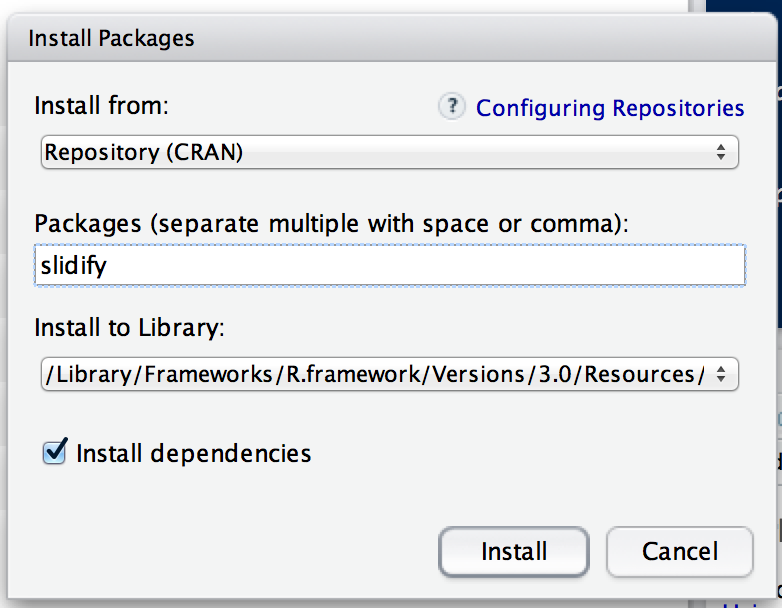

## R Packages

- When you download R from the Comprehensive R Archive Network (CRAN),
  you get that ``base" R system

- The base R system comes with basic functionality; implements the R language

- One reason R is so useful is the large collection of packages that
  extend the basic functionality of R

- R packages are developed and published by the larger R community

--- 

## Obtaining R Packages

- The primary location for obtaining R packages is
  [CRAN](http://cran.r-project.org)

- For biological and biomedical applications, many packages are
  available from the [Bioconductor Project](http://bioconductor.org)

- There are over 4,000 packages on CRAN covering a wide range of topics

- A list of some topics is available through the [Task
  Views](http://cran.r-project.org/web/views/) link, which groups
  together many R packages related to a given topic

---

## Installing an R Package

- Packages can be installed with the `install.packages()`
  function in R

- To install a single package, pass the name of the lecture to the
  `install.packages()` function as the first argument

- The following the code installs the **slidify** package from CRAN

```{r, eval=FALSE}
install.packages("slidify")
```

- This command downloads the **slidify** package from CRAN and
  installs it on your computer

- Any packages that this package depends on will also be downloaded
  and installed

---

## Installing an R Package

- You can install multiple R packages at once with a single call to
  `install.packages()`

- Place the names of the R packages in a character vector

```{r, eval=FALSE}
install.packages(c("slidify", "ggplot2", "devtools"))
```

---

## Installing an R Package in RStudio


--- 

## Installing an R Package in RStudio



---

## Loading R Packages

- The `library()` function is used to load packages into R

- The following code is used to load the **ggplot2** package into R

```{r,eval=FALSE}
library(ggplot2)
```

- Any packages that need to be loaded as dependencies will be loaded
  first, before the named package is loaded

- NOTE: Do not put the package name in quotes!

- Some packages produce messages when they are loaded (but some don't)

---

## Summary

- R packages provide a powerful mechanism for extending the
  functionality of R

- R packages can be obtained from CRAN or other repositories

- The `install.packages()` can be used to install packages at the R
  console

- The `library()` function loads packages that have been installed.
