## Why do we use graphs in data analysis? 

* To understand data properties
* To find patterns in data
* To suggest modeling strategies
* To "debug" analyses
* To communicate results

---

## Exploratory graphs

* <redtext>To understand data properties</redtext>
* <redtext>To find patterns in data</redtext>
* <redtext>To suggest modeling strategies</redtext>
* <redtext>To "debug" analyses</redtext>
* To communicate results

---

## Characteristics of exploratory graphs

* They are made quickly
* A large number are made
* The goal is for personal understanding
* Axes/legends are generally not cleaned up
* Color/size are primarily used for information

---

## Housing data


<br>


```r
pData <- read.csv("./data/ss06pid.csv")
```


--- 

## Scatterplots

* Important paramters: _x_,_y_,_type_,_xlab_,_ylab_,_xlim_,_ylim_,_cex_,_col_,_bg_
* See ?par for more


```r
plot(pData$JWMNP,pData$WAGP,pch=19,col="blue")
```

<div class="rimage center">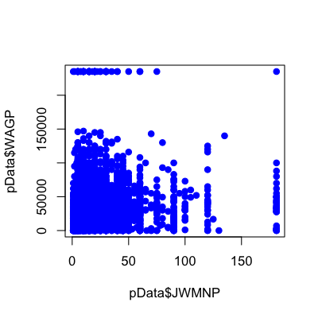</div>


--- 

## Scatterplots - size matters


```r
plot(pData$JWMNP,pData$WAGP,pch=19,col="blue",cex=0.5)
```

<div class="rimage center">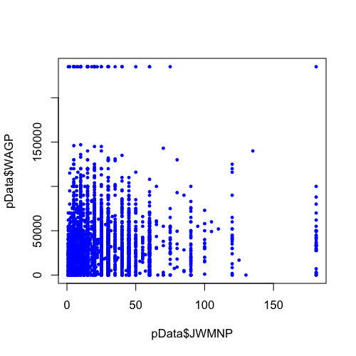</div>


--- 

## Scatterplots - using color


```r
plot(pData$JWMNP,pData$WAGP,pch=19,col=pData$SEX,cex=0.5)
```

<div class="rimage center">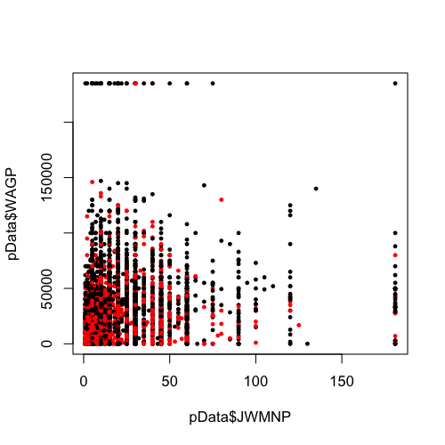</div>


--- 

## Scatterplots - using size


```r
percentMaxAge <- pData$AGEP/max(pData$AGEP)
plot(pData$JWMNP,pData$WAGP,pch=19,col="blue",cex=percentMaxAge*0.5)
```

<div class="rimage center">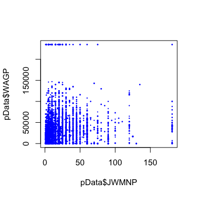</div>


--- 

## Scatterplots - overlaying lines/points


```r
plot(pData$JWMNP,pData$WAGP,pch=19,col="blue",cex=0.5)
lines(rep(100,dim(pData)[1]),pData$WAGP,col="grey",lwd=5)
points(seq(0,200,length=100),seq(0,20e5,length=100),col="red",pch=19)
```

<div class="rimage center">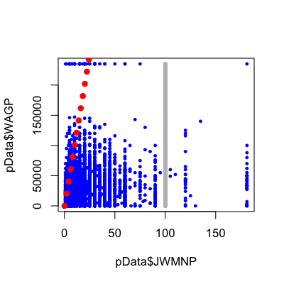</div>


--- 

## Scatterplots - numeric variables as factors


```r
library(Hmisc)
ageGroups <- cut2(pData$AGEP,g=5)
plot(pData$JWMNP,pData$WAGP,pch=19,col=ageGroups,cex=0.5)
```

<div class="rimage center">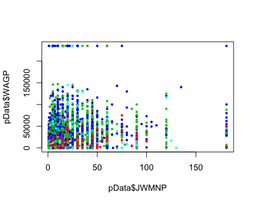</div>


---

## If you have a lot of points


```r
x <- rnorm(1e5)
y <- rnorm(1e5)
plot(x,y,pch=19)
```

<div class="rimage center">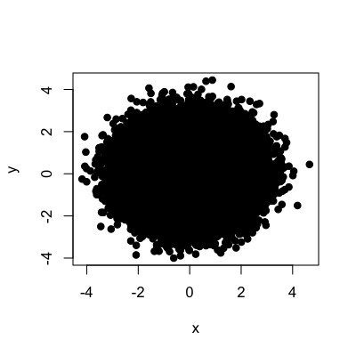</div>


---

## If you have a lot of points - sampling


```r
x <- rnorm(1e5)
y <- rnorm(1e5)
sampledValues <- sample(1:1e5,size=1000,replace=FALSE)
plot(x[sampledValues],y[sampledValues],pch=19)
```

<div class="rimage center">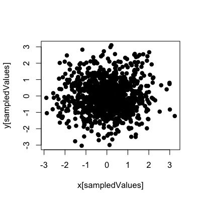</div>


---

## If you have a lot of points - smoothScatter


```r
x <- rnorm(1e5)
y <- rnorm(1e5)
smoothScatter(x,y)
```

<div class="rimage center">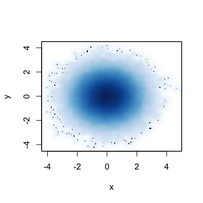</div>


---

## If you have a lot of points - hexbin {hexbin}


```r
library(hexbin)
x <- rnorm(1e5)
y <- rnorm(1e5)
hbo <- hexbin(x,y)
plot(hbo)
```


---

## QQ-plots

* Important parameters: _x_,_y_


```r
x <- rnorm(20); y <- rnorm(20)
qqplot(x,y)
abline(c(0,1))
```

<div class="rimage center">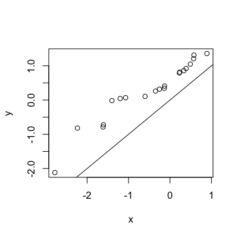</div>


--- 

## Matplot and spaghetti

* Important paramters: _x_, _y_, _lty_,_lwd_,_pch_,_col_


```r
X <- matrix(rnorm(20*5),nrow=20)
matplot(X,type="b")
```

<div class="rimage center">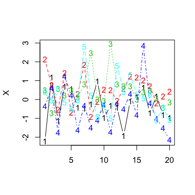</div>


--- 

## Heatmaps

* Important paramters: _x_,_y_,_z_,_col_

```r
image(1:10,161:236,as.matrix(pData[1:10,161:236]))
```

<div class="rimage center">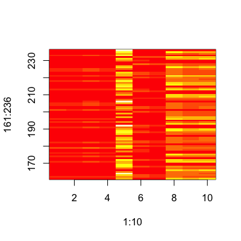</div>


---

## Heatmaps - matching intuition


```r
newMatrix <- as.matrix(pData[1:10,161:236])
newMatrix <- t(newMatrix)[,nrow(newMatrix):1]
image(161:236, 1:10, newMatrix)
```

<div class="rimage center"></div>


---

## Maps - very basics 

You make need to run `install.packages("maps")` if you don't have the `maps` package installed. 


```r
library(maps)
map("world")
lat <- runif(40,-180,180); lon <- runif(40,-90,90)
points(lat,lon,col="blue",pch=19)
```

<div class="rimage center">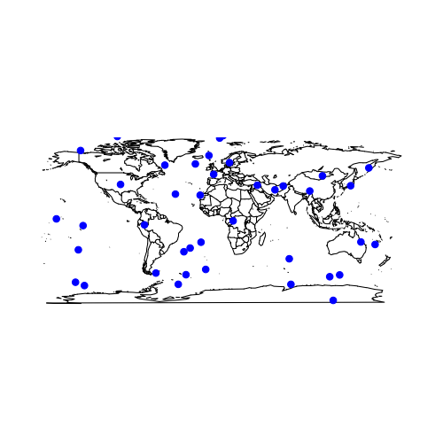</div>


---

## Missing values and plots


```r
x <- c(NA,NA,NA,4,5,6,7,8,9,10)
y <- 1:10
plot(x,y,pch=19,xlim=c(0,11),ylim=c(0,11))
```

<div class="rimage center">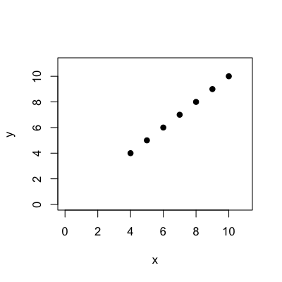</div>


---

## Missing values and plots


```r
x <- rnorm(100)
y <- rnorm(100)
y[x < 0] <- NA
boxplot(x ~ is.na(y))
```

<div class="rimage center">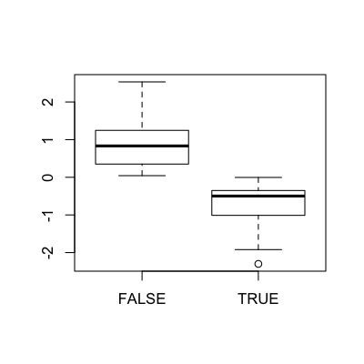</div>


---

## Further resources

* [R Graph Gallery](http://gallery.r-enthusiasts.com/)
* [ggplot2](http://cran.r-project.org/web/packages/ggplot2/index.html),[ggplot2 basic introduction](http://www.r-bloggers.com/basic-introduction-to-ggplot2/)
* [lattice package](http://cran.r-project.org/web/packages/lattice/index.html),[lattice introduction](http://lmdvr.r-forge.r-project.org/figures/figures.html)
* [R bloggers](http://www.r-bloggers.com/)


