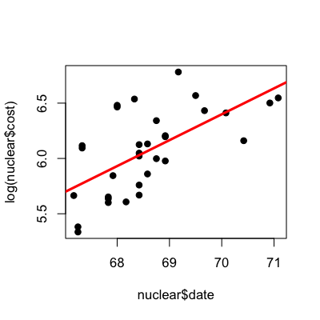
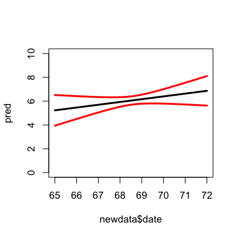
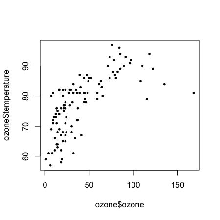
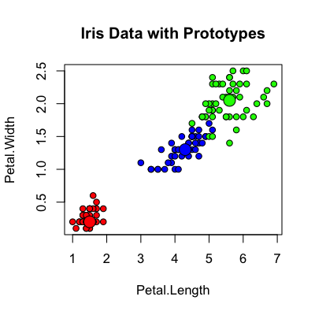
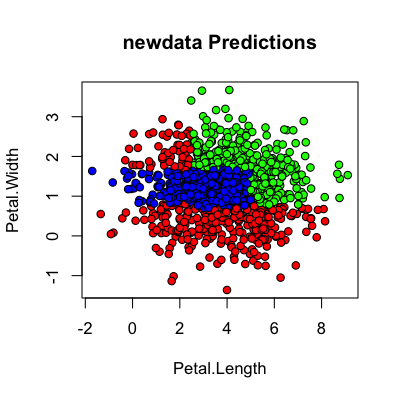

## Key ideas

* Bootstrapping can be used for
  * Cross-validation type error rates
  * Prediction errors in regression models
  * Improving prediction

---

## Bootstrapping prediction errors


```r
library(boot); data(nuclear)
nuke.lm <- lm(log(cost) ~ date,data=nuclear)
plot(nuclear$date,log(nuclear$cost),pch=19)
abline(nuke.lm,col="red",lwd=3)
```

<div class="rimage center"></div>


---

## Bootstrapping prediction errors


```r
newdata <- data.frame(date = seq(65,72,length=100))
nuclear <- cbind(nuclear,resid=rstudent(nuke.lm),fit=fitted(nuke.lm))
nuke.fun <- function(data,inds,newdata){
  lm.b <- lm(fit + resid[inds] ~ date,data=data)
  pred.b <- predict(lm.b,newdata)
  return(pred.b)
}
nuke.boot <- boot(nuclear,nuke.fun,R=1000,newdata=newdata)
head(nuke.boot$t)
```

```
      [,1]  [,2]  [,3]  [,4]  [,5]  [,6]  [,7]  [,8]  [,9] [,10] [,11] [,12] [,13] [,14] [,15]
[1,] 5.475 5.490 5.506 5.521 5.536 5.551 5.566 5.581 5.597 5.612 5.627 5.642 5.657 5.672 5.688
[2,] 6.370 6.365 6.359 6.354 6.348 6.343 6.337 6.332 6.326 6.321 6.315 6.310 6.304 6.299 6.293
[3,] 5.353 5.366 5.380 5.393 5.406 5.420 5.433 5.446 5.459 5.473 5.486 5.499 5.513 5.526 5.539
[4,] 4.476 4.506 4.537 4.567 4.597 4.627 4.658 4.688 4.718 4.748 4.779 4.809 4.839 4.869 4.900
[5,] 4.980 5.002 5.024 5.046 5.067 5.089 5.111 5.133 5.155 5.177 5.199 5.220 5.242 5.264 5.286
[6,] 2.674 2.739 2.804 2.869 2.935 3.000 3.065 3.130 3.195 3.260 3.325 3.390 3.456 3.521 3.586
     [,16] [,17] [,18] [,19] [,20] [,21] [,22] [,23] [,24] [,25] [,26] [,27] [,28] [,29] [,30]
[1,] 5.703 5.718 5.733 5.748 5.763 5.779 5.794 5.809 5.824 5.839 5.854 5.870 5.885 5.900 5.915
[2,] 6.288 6.282 6.277 6.271 6.266 6.260 6.255 6.249 6.244 6.238 6.233 6.227 6.222 6.216 6.211
[3,] 5.553 5.566 5.579 5.593 5.606 5.619 5.633 5.646 5.659 5.673 5.686 5.699 5.713 5.726 5.739
[4,] 4.930 4.960 4.991 5.021 5.051 5.081 5.112 5.142 5.172 5.202 5.233 5.263 5.293 5.323 5.354
[5,] 5.308 5.330 5.352 5.373 5.395 5.417 5.439 5.461 5.483 5.505 5.526 5.548 5.570 5.592 5.614
[6,] 3.651 3.716 3.781 3.846 3.912 3.977 4.042 4.107 4.172 4.237 4.302 4.367 4.433 4.498 4.563
     [,31] [,32] [,33] [,34] [,35] [,36] [,37] [,38] [,39] [,40] [,41] [,42] [,43] [,44] [,45]
[1,] 5.930 5.945 5.961 5.976 5.991 6.006 6.021 6.036 6.052 6.067 6.082 6.097 6.112 6.127 6.143
[2,] 6.205 6.200 6.194 6.189 6.183 6.178 6.172 6.167 6.161 6.156 6.150 6.145 6.139 6.134 6.128
[3,] 5.752 5.766 5.779 5.792 5.806 5.819 5.832 5.846 5.859 5.872 5.886 5.899 5.912 5.926 5.939
[4,] 5.384 5.414 5.445 5.475 5.505 5.535 5.566 5.596 5.626 5.656 5.687 5.717 5.747 5.777 5.808
[5,] 5.636 5.658 5.679 5.701 5.723 5.745 5.767 5.789 5.811 5.832 5.854 5.876 5.898 5.920 5.942
[6,] 4.628 4.693 4.758 4.823 4.888 4.954 5.019 5.084 5.149 5.214 5.279 5.344 5.410 5.475 5.540
     [,46] [,47] [,48] [,49] [,50] [,51] [,52] [,53] [,54] [,55] [,56] [,57] [,58] [,59] [,60]
[1,] 6.158 6.173 6.188 6.203 6.218 6.234 6.249 6.264 6.279 6.294 6.309 6.325 6.340 6.355 6.370
[2,] 6.123 6.117 6.112 6.107 6.101 6.096 6.090 6.085 6.079 6.074 6.068 6.063 6.057 6.052 6.046
[3,] 5.952 5.966 5.979 5.992 6.006 6.019 6.032 6.045 6.059 6.072 6.085 6.099 6.112 6.125 6.139
[4,] 5.838 5.868 5.898 5.929 5.959 5.989 6.020 6.050 6.080 6.110 6.141 6.171 6.201 6.231 6.262
[5,] 5.964 5.985 6.007 6.029 6.051 6.073 6.095 6.117 6.138 6.160 6.182 6.204 6.226 6.248 6.270
[6,] 5.605 5.670 5.735 5.800 5.865 5.931 5.996 6.061 6.126 6.191 6.256 6.321 6.386 6.452 6.517
     [,61] [,62] [,63] [,64] [,65] [,66] [,67] [,68] [,69] [,70] [,71] [,72] [,73] [,74] [,75]
[1,] 6.385 6.400 6.416 6.431 6.446 6.461 6.476 6.492 6.507 6.522 6.537 6.552 6.567 6.583 6.598
[2,] 6.041 6.035 6.030 6.024 6.019 6.013 6.008 6.002 5.997 5.991 5.986 5.980 5.975 5.969 5.964
[3,] 6.152 6.165 6.179 6.192 6.205 6.219 6.232 6.245 6.259 6.272 6.285 6.299 6.312 6.325 6.338
[4,] 6.292 6.322 6.352 6.383 6.413 6.443 6.474 6.504 6.534 6.564 6.595 6.625 6.655 6.685 6.716
[5,] 6.291 6.313 6.335 6.357 6.379 6.401 6.423 6.444 6.466 6.488 6.510 6.532 6.554 6.576 6.597
[6,] 6.582 6.647 6.712 6.777 6.842 6.908 6.973 7.038 7.103 7.168 7.233 7.298 7.363 7.429 7.494
     [,76] [,77] [,78] [,79] [,80] [,81] [,82] [,83] [,84] [,85] [,86] [,87] [,88] [,89] [,90]
[1,] 6.613 6.628 6.643 6.658 6.674 6.689 6.704 6.719 6.734 6.749 6.765 6.780 6.795 6.810 6.825
[2,] 5.958 5.953 5.947 5.942 5.936 5.931 5.925 5.920 5.914 5.909 5.903 5.898 5.892 5.887 5.881
[3,] 6.352 6.365 6.378 6.392 6.405 6.418 6.432 6.445 6.458 6.472 6.485 6.498 6.512 6.525 6.538
[4,] 6.746 6.776 6.806 6.837 6.867 6.897 6.927 6.958 6.988 7.018 7.049 7.079 7.109 7.139 7.170
[5,] 6.619 6.641 6.663 6.685 6.707 6.729 6.750 6.772 6.794 6.816 6.838 6.860 6.882 6.903 6.925
[6,] 7.559 7.624 7.689 7.754 7.819 7.884 7.950 8.015 8.080 8.145 8.210 8.275 8.340 8.405 8.471
     [,91] [,92] [,93] [,94] [,95] [,96] [,97] [,98] [,99] [,100]
[1,] 6.840 6.856 6.871 6.886 6.901 6.916 6.931 6.947 6.962  6.977
[2,] 5.876 5.870 5.865 5.859 5.854 5.848 5.843 5.837 5.832  5.826
[3,] 6.552 6.565 6.578 6.592 6.605 6.618 6.631 6.645 6.658  6.671
[4,] 7.200 7.230 7.260 7.291 7.321 7.351 7.381 7.412 7.442  7.472
[5,] 6.947 6.969 6.991 7.013 7.035 7.056 7.078 7.100 7.122  7.144
[6,] 8.536 8.601 8.666 8.731 8.796 8.861 8.927 8.992 9.057  9.122
```


---

## Bootstrapping prediction errors


```r
pred <- predict(nuke.lm,newdata)
predSds <- apply(nuke.boot$t,2,sd)
plot(newdata$date,pred,col="black",type="l",lwd=3,ylim=c(0,10))
lines(newdata$date,pred + 1.96*predSds,col="red",lwd=3)
lines(newdata$date,pred - 1.96*predSds,col="red",lwd=3)
```

<div class="rimage center"></div>


---

## Bootstrap aggregating (bagging)

__Basic idea__: 

1. Resample cases and recalculate predictions
2. Average or majority vote

__Notes__:

* Similar bias 
* Reduced variance
* More useful for non-linear functions


---

## Bagged loess


```r
library(ElemStatLearn); data(ozone,package="ElemStatLearn")
ozone <- ozone[order(ozone$ozone),]
head(ozone)
```

```
    ozone radiation temperature wind
17      1         8          59  9.7
19      4        25          61  9.7
14      6        78          57 18.4
45      7        48          80 14.3
106     7        49          69 10.3
7       8        19          61 20.1
```

[http://en.wikipedia.org/wiki/Bootstrap_aggregating](http://en.wikipedia.org/wiki/Bootstrap_aggregating)

---

## Bagged loess


```r
ll <- matrix(NA,nrow=10,ncol=155)
for(i in 1:10){
  ss <- sample(1:dim(ozone)[1],replace=T)
  ozone0 <- ozone[ss,]; ozone0 <- ozone0[order(ozone0$ozone),]
  loess0 <- loess(temperature ~ ozone,data=ozone0,span=0.2)
  ll[i,] <- predict(loess0,newdata=data.frame(ozone=1:155))
}
```


---

## Bagged loess


```r
plot(ozone$ozone,ozone$temperature,pch=19,cex=0.5)
```

<div class="rimage center"></div>

```r
for(i in 1:10){lines(1:155,ll[i,],col="grey",lwd=2)}
lines(1:155,apply(ll,2,mean),col="red",lwd=2)
```


---

## Bagged trees

__Basic idea__:

1. Resample data
2. Recalculate tree
3. Average/[mode](http://en.wikipedia.org/wiki/Mode_(statistics)) of predictors 

__Notes__:

1. More stable
2. May not be as good as random forests


---

## Iris data


```r
data(iris)
head(iris)
```

```
  Sepal.Length Sepal.Width Petal.Length Petal.Width Species
1          5.1         3.5          1.4         0.2  setosa
2          4.9         3.0          1.4         0.2  setosa
3          4.7         3.2          1.3         0.2  setosa
4          4.6         3.1          1.5         0.2  setosa
5          5.0         3.6          1.4         0.2  setosa
6          5.4         3.9          1.7         0.4  setosa
```


---

## Bagging a tree


```r
library(ipred)
bagTree <- bagging(Species ~.,data=iris,coob=TRUE)
print(bagTree)
```

```

Bagging classification trees with 25 bootstrap replications 

Call: bagging.data.frame(formula = Species ~ ., data = iris, coob = TRUE)

Out-of-bag estimate of misclassification error:  0.0667 
```


---

## Looking at bagged tree one


```r
bagTree$mtrees[[1]]$btree
```

```
n= 150 

node), split, n, loss, yval, (yprob)
      * denotes terminal node

  1) root 150 98 virginica (0.32667 0.32667 0.34667)  
    2) Petal.Length< 2.6 49  0 setosa (1.00000 0.00000 0.00000) *
    3) Petal.Length>=2.6 101 49 virginica (0.00000 0.48515 0.51485)  
      6) Petal.Length< 4.85 48  2 versicolor (0.00000 0.95833 0.04167)  
       12) Sepal.Length>=4.95 46  0 versicolor (0.00000 1.00000 0.00000) *
       13) Sepal.Length< 4.95 2  0 virginica (0.00000 0.00000 1.00000) *
      7) Petal.Length>=4.85 53  3 virginica (0.00000 0.05660 0.94340)  
       14) Petal.Width< 1.7 10  3 virginica (0.00000 0.30000 0.70000)  
         28) Sepal.Width>=3.05 2  0 versicolor (0.00000 1.00000 0.00000) *
         29) Sepal.Width< 3.05 8  1 virginica (0.00000 0.12500 0.87500)  
           58) Sepal.Length< 6.05 3  1 virginica (0.00000 0.33333 0.66667)  
            116) Sepal.Width>=2.45 1  0 versicolor (0.00000 1.00000 0.00000) *
            117) Sepal.Width< 2.45 2  0 virginica (0.00000 0.00000 1.00000) *
           59) Sepal.Length>=6.05 5  0 virginica (0.00000 0.00000 1.00000) *
       15) Petal.Width>=1.7 43  0 virginica (0.00000 0.00000 1.00000) *
```


---

## Looking at bagged tree two


```r
bagTree$mtrees[[2]]$btree
```

```
n= 150 

node), split, n, loss, yval, (yprob)
      * denotes terminal node

  1) root 150 92 versicolor (0.28667 0.38667 0.32667)  
    2) Petal.Length< 2.7 43  0 setosa (1.00000 0.00000 0.00000) *
    3) Petal.Length>=2.7 107 49 versicolor (0.00000 0.54206 0.45794)  
      6) Petal.Width< 1.65 59  3 versicolor (0.00000 0.94915 0.05085)  
       12) Petal.Length< 5.35 57  1 versicolor (0.00000 0.98246 0.01754)  
         24) Petal.Length< 4.85 54  0 versicolor (0.00000 1.00000 0.00000) *
         25) Petal.Length>=4.85 3  1 versicolor (0.00000 0.66667 0.33333)  
           50) Sepal.Width>=2.45 2  0 versicolor (0.00000 1.00000 0.00000) *
           51) Sepal.Width< 2.45 1  0 virginica (0.00000 0.00000 1.00000) *
       13) Petal.Length>=5.35 2  0 virginica (0.00000 0.00000 1.00000) *
      7) Petal.Width>=1.65 48  2 virginica (0.00000 0.04167 0.95833)  
       14) Petal.Width< 1.85 11  2 virginica (0.00000 0.18182 0.81818)  
         28) Sepal.Width>=2.9 6  2 virginica (0.00000 0.33333 0.66667)  
           56) Petal.Length< 5.05 3  1 versicolor (0.00000 0.66667 0.33333)  
            112) Sepal.Length< 5.95 1  0 versicolor (0.00000 1.00000 0.00000) *
            113) Sepal.Length>=5.95 2  1 versicolor (0.00000 0.50000 0.50000)  
              226) Sepal.Length>=6.35 1  0 versicolor (0.00000 1.00000 0.00000) *
              227) Sepal.Length< 6.35 1  0 virginica (0.00000 0.00000 1.00000) *
           57) Petal.Length>=5.05 3  0 virginica (0.00000 0.00000 1.00000) *
         29) Sepal.Width< 2.9 5  0 virginica (0.00000 0.00000 1.00000) *
       15) Petal.Width>=1.85 37  0 virginica (0.00000 0.00000 1.00000) *
```


---

## Random forests

1. Bootstrap samples
2. At each split, bootstrap variables
3. Grow multiple trees and vote

__Pros__:

1. Accuracy

__Cons__:

1. Speed
2. Interpretability
3. Overfitting


---

## Random forests

```r
library(randomForest)
forestIris <- randomForest(Species~ Petal.Width + Petal.Length,data=iris,prox=TRUE)
forestIris
```

```

Call:
 randomForest(formula = Species ~ Petal.Width + Petal.Length,      data = iris, prox = TRUE) 
               Type of random forest: classification
                     Number of trees: 500
No. of variables tried at each split: 1

        OOB estimate of  error rate: 3.33%
Confusion matrix:
           setosa versicolor virginica class.error
setosa         50          0         0        0.00
versicolor      0         47         3        0.06
virginica       0          2        48        0.04
```


---

## Getting a single tree


```r
getTree(forestIris,k=2)
```

```
  left daughter right daughter split var split point status prediction
1             2              3         1        0.80      1          0
2             0              0         0        0.00     -1          1
3             4              5         1        1.75      1          0
4             6              7         2        5.45      1          0
5             8              9         1        1.85      1          0
6             0              0         0        0.00     -1          2
7             0              0         0        0.00     -1          3
8             0              0         0        0.00     -1          3
9             0              0         0        0.00     -1          3
```


---

## Class "centers"


```r
iris.p <- classCenter(iris[,c(3,4)], iris$Species, forestIris$prox)
plot(iris[,3], iris[,4], pch=21, xlab=names(iris)[3], ylab=names(iris)[4],
bg=c("red", "blue", "green")[as.numeric(factor(iris$Species))],
main="Iris Data with Prototypes")
points(iris.p[,1], iris.p[,2], pch=21, cex=2, bg=c("red", "blue", "green"))
```

<div class="rimage center"></div>


---

## Combining random forests


```r
forestIris1 <- randomForest(Species~Petal.Width + Petal.Length,data=iris,prox=TRUE,ntree=50)
forestIris2 <- randomForest(Species~Petal.Width + Petal.Length,data=iris,prox=TRUE,ntree=50)
forestIris3 <- randomForest(Species~Petal.Width + Petal.Length,data=iris,prox=TRUE,nrtee=50)
combine(forestIris1,forestIris2,forestIris3)
```

```

Call:
 randomForest(formula = Species ~ Petal.Width + Petal.Length,      data = iris, prox = TRUE, ntree = 50) 
               Type of random forest: classification
                     Number of trees: 600
No. of variables tried at each split: 1
```


---

## Predicting new values


```r
newdata <- data.frame(Sepal.Length<- rnorm(1000,mean(iris$Sepal.Length),
                                           sd(iris$Sepal.Length)),
                      Sepal.Width <- rnorm(1000,mean(iris$Sepal.Width),
                                           sd(iris$Sepal.Width)),
                      Petal.Width <- rnorm(1000,mean(iris$Petal.Width),
                                           sd(iris$Petal.Width)),
                      Petal.Length <- rnorm(1000,mean(iris$Petal.Length),
                                            sd(iris$Petal.Length)))

pred <- predict(forestIris,newdata)
```


---

## Predicting new values


```r
plot(newdata[,4], newdata[,3], pch=21, xlab="Petal.Length",ylab="Petal.Width",
bg=c("red", "blue", "green")[as.numeric(pred)],main="newdata Predictions")
```

<div class="rimage center"></div>


---

## Notes and further resources

__Notes__:

* Bootstrapping is useful for nonlinear models
* Care should be taken to avoid overfitting (see [rfcv](http://cran.r-project.org/web/packages/randomForest/randomForest.pdf) funtion)
* Out of bag estimates are efficient estimates of test error

__Further resources__:

* [Random forests](http://www.stat.berkeley.edu/~breiman/RandomForests/cc_home.htm)
* [Random forest Wikipedia](http://en.wikipedia.org/wiki/Random_forest)
* [Bagging](http://en.wikipedia.org/wiki/Bootstrap_aggregating)
* [Bagging and boosting](http://stat.ethz.ch/education/semesters/FS_2008/CompStat/sk-ch8.pdf)
